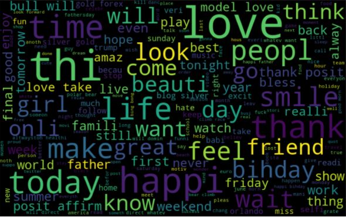
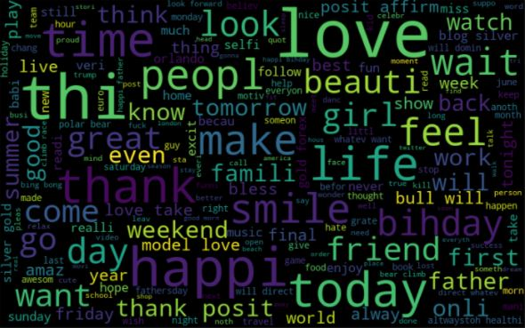
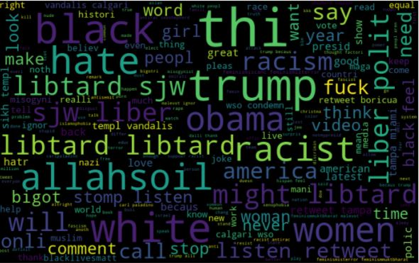
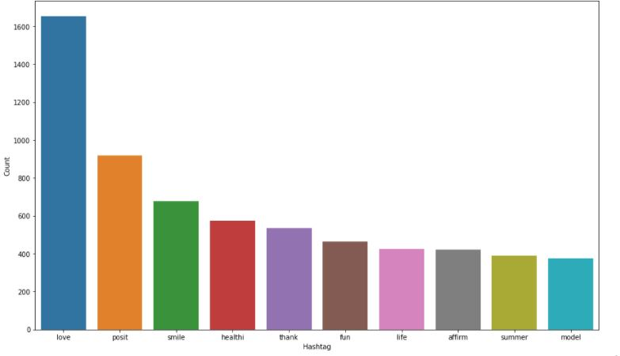
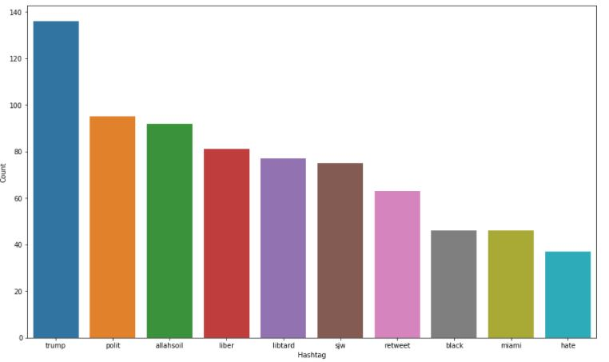

# Twitter-Sentiment-Analysis

## Objective

The objective of this task is to detect hate speech in tweets. For the sake of simplicity, we say a tweet contains hate speech if it has a racist or sexist sentiment associated with it. So, the task is to classify racist or sexist tweets from other tweets.

Formally, given a training sample of tweets and labels, where label '1' denotes the tweet is racist/sexist and label '0' denotes the tweet is not racist/sexist, your objective is to predict the labels on the test dataset.

For training the models, we provide a labelled dataset of 31,962 tweets. The dataset is provided in the form of a csv file with each line storing a tweet id, its label and the tweet.

## Exploratory Data Analysis

### Frequent Words:

### Positive Words:

### Racist/Sexist Words:

### Top Positive Hashtags:

### Top Racist/Sexist Hashtags:

## Model Building and Evaluation
Models trained:  
* Logistic Regression
* Decision Tree

### Results:
Logistic Regression:  
F1 Score: 0.49763033175355453  
Accuracy: 0.9469403078463271  

Decision Tree:  
F1 Score: 0.4948453608247423  
Accuracy: 0.9264172193717932
